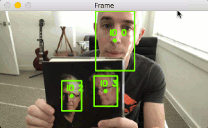

# Simple object tracking with OpenCV
### Tracks the objects given their bouding boxes

Amazing yet simple object tracker built entirely with OpenCV

All thanks to Adrian Rosebrock (from [pyimagesearch](https://www.pyimagesearch.com/)) for making
great tutorials. This project is inspired from his blog: [Simple object tracking with OpenCV](https://www.pyimagesearch.com/2018/07/23/simple-object-tracking-with-opencv/). I have included the author's code and the one i wrote my self as well.

## **Key Points**
1. Steps involved:
    1. Detect the objects in the image and calculate their centroids.
    2. Find out the previous occurrence of that all those objects using euclidean distance. Some objects might be new and some might have gone out of frame.
    3. Track the objecs as it moves around in the video and print the associated id with them.
2. Assumptions:
    1. The object detection part is not built here. It should have been built previously. We take the face detection deep learning model here to detect faces.
    2. The objects don't move too fast in the video.
    3. The object moves in the frame but the distance between the centroids in the current and next frame is smaller than all other distances between objects.
3. This approach is based on Centroid tracking.
4. Euclidean distance is used to calculate the distance between new objects detections and previous ones.
5. The smaller the euclidean distance of new object to the old object, the more are the chances of it being the same old object.
6. The bounding boxes can be produced by any type of object detector like (color thresholding + contour extraction, Haar Cascades, HOG + Linear SVM, Faster RCNNs, etc.)
7. Video stream from webcam is used in this project to do object tracking.
8. OpenCV's deep learning based face detector is used to detect faces.

 ## **Requirements: (with versions i tested on)**
 1. python          (3.7.3)
 2. opencv          (4.1.0)
 3. numpy           (1.61.4)
 4. imutils         (0.5.2)

 ## **Commands to run the detection:**
 ```
 python object_tracker.py --prototxt deploy.prototxt \
	--model res10_300x300_ssd_iter_140000.caffemodel
```

## **Results:**
The results are awesome. We are successfully able to detect and track the objects in the video stream via webcam.




## **The limitations**
1. This project requires the object detection to be run on every frame of the video. This could be slow for heavy deep learning based detector, but can work for fast detectors (like color thresholding  and Haar cascades) that don't do heavy computations.
2. The centroid tacking algorithm requires that the centroids must lie close together between subsequent frames.
3. There could be object id  switching if the objects overlap each other. 
